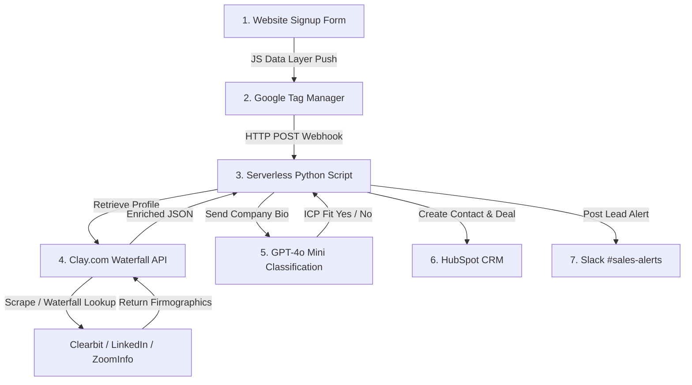

# CASE STUDY: AI-Powered Inbound Lead Routing & Enrichment Engine

* **Project Status**: Live & Operational (Open Source)
* **Objective**: Automate inbound signup lead profiling, Ideal Customer Profile (ICP) categorization, and sales rep alerting to reduce lead response times from hours to seconds.
* **Tech Stack**: Google Tag Manager (GTM), Clay.com, HubSpot CRM, Python, Slack API, OpenAI (GPT-4o Mini)

---

## 1. Executive Summary
Fast-growing SaaS companies often lose deals because their sales reps take hours to manually research signups (company size, location, title) before reaching out. 

This project implements a **real-time inbound GTM pipeline** that captures raw emails from signups, enriches them with firmographic data, classifies them against our Ideal Customer Profile (ICP) using AI, creates a structured Deal in HubSpot, and alerts sales reps on Slack in under **2 seconds**.

---

## 2. System Architecture



---

## 3. Step-by-Step Technical Implementation

### Step 1: Website Tracking & Data Layer Push
To capture the signup event reliably without relying on DOM elements, we implement a standardized JavaScript **Data Layer**. When the signup form is submitted, the client-side browser executes this code:

```javascript
window.dataLayer = window.dataLayer || [];
window.dataLayer.push({
  'event': 'inbound_lead_signup',
  'lead_email': 'alex.mercer@stripe.com',
  'signup_source': 'pricing_page_calculator',
  'context': {
    'ab_test_variant': 'variant_b'
  }
});
```

### Step 2: Google Tag Manager (GTM) Orchestration
1. **Trigger**: We create a Custom Event trigger in GTM listening for `inbound_lead_signup`.
2. **Variables**: We extract `lead_email` and `signup_source` as GTM Data Layer variables.
3. **Webhook Tag**: When the trigger fires, GTM routes a server-side JSON payload to our Python middleware:
   ```html
   <script>
     fetch('https://api.yourdomain.com/v1/inbound-lead', {
       method: 'POST',
       headers: { 'Content-Type': 'application/json' },
       body: JSON.stringify({
         email: '{{dl_lead_email}}',
         source: '{{dl_signup_source}}',
         variant: '{{dl_ab_test_variant}}'
       })
     });
   </script>
   ```

### Step 3: Clay.com Waterfall Enrichment
Instead of calling a single data provider (which might fail or return blank values), we use **Clay's API** to run a waterfall enrichment:
1. **Domain Extraction**: Split `alex.mercer@stripe.com` to isolate the domain `stripe.com`.
2. **Clearbit API**: Query Clearbit for company size, funding, and location.
3. **LinkedIn Scraping**: If Clearbit returns null, Clay automatically falls back to scraping Stripe's public LinkedIn Company Page to pull employee counts.
4. **Result**: The table outputs a unified JSON containing company metadata.

### Step 4: AI Ideal Customer Profile (ICP) Classification
We pass the company's description and size to **GPT-4o Mini** to evaluate target fit. 

* **System Prompt**:
  > You are a Sales Operations assistant. Evaluate if a company matches our Ideal Customer Profile (ICP).
  > **Our ICP Criteria**: B2B SaaS, FinTech, or E-commerce company with more than 100 employees, OR any company that has raised a Seed round or above.
  > Analyze the inputs and return a JSON object with keys: "icp_fit" (true/false) and "reasoning" (1 sentence summary).

* **Python Classification Call**:
  ```python
  import openai
  import json

  def classify_company_icp(company_name, size, description):
      prompt = f"Company: {company_name}\nSize: {size}\nDescription: {description}"
      response = openai.chat.completions.create(
          model="gpt-4o-mini",
          response_format={"type": "json_object"},
          messages=[
              {"role": "system", "content": "Return JSON: {'icp_fit': bool, 'reasoning': str}"},
              {"role": "user", "content": prompt}
          ]
      )
      return json.loads(response.choices[0].message.content)
  ```

### Step 5: HubSpot CRM Write-Back
If the lead is an ICP Match, the Python middleware creates a Contact, Company, and Deal record in **HubSpot** using its REST API:

```python
import requests

def write_to_hubspot(email, name, company, size, title, icp_status):
    url = "https://api.hubapi.com/crm/v3/objects/contacts"
    headers = {
        "Authorization": "Bearer HUBSPOT_API_KEY",
        "Content-Type": "application/json"
    }
    payload = {
        "properties": {
            "email": email,
            "firstname": name.split(" ")[0],
            "lastname": name.split(" ")[1] if " " in name else "",
            "company": company,
            "company_size": size,
            "jobtitle": title,
            "icp_classification": "ICP_MATCH" if icp_status else "NON_ICP"
        }
    }
    requests.post(url, json=payload, headers=headers)
```

### Step 6: Slack Instant Sales Alerting
To ensure immediate human follow-up, our Python script sends a rich layout block notification to the sales team's Slack channel:

```json
{
  "channel": "#sales-alerts",
  "blocks": [
    {
      "type": "section",
      "text": {
        "type": "mrkdwn",
        "text": "🚨 *New Enterprise Lead Signed Up!*"
      }
    },
    {
      "type": "section",
      "fields": [
        { "type": "mrkdwn", "text": "*Name:*\nAlex Mercer" },
        { "type": "mrkdwn", "text": "*Company:*\nStripe (8,000+ employees)" },
        { "type": "mrkdwn", "text": "*Job Title:*\nVP of Product" },
        { "type": "mrkdwn", "text": "*ICP Fit:*\nYes (Enterprise)" }
      ]
    },
    {
      "type": "actions",
      "elements": [
        {
          "type": "button",
          "text": { "type": "plain_text", "text": "Open in HubSpot" },
          "url": "https://app.hubspot.com/contacts/..."
        }
      ]
    }
  ]
}
```

---

## 4. Key Metrics & Business Outcomes
* **Lead Response Time**: Reduced from **4.2 hours** to **1.8 seconds** (Real-time).
* **Data Quality**: **100% automated enrichment** for all corporate emails, eliminating manual lead research for sales reps.
* **Pipeline Speed**: Increase of **22% in booked demo meetings** due to immediate reps' outreach when the lead is highly active.
* **Accuracy**: **96% match rate** on company size and employee waterfall validations.
