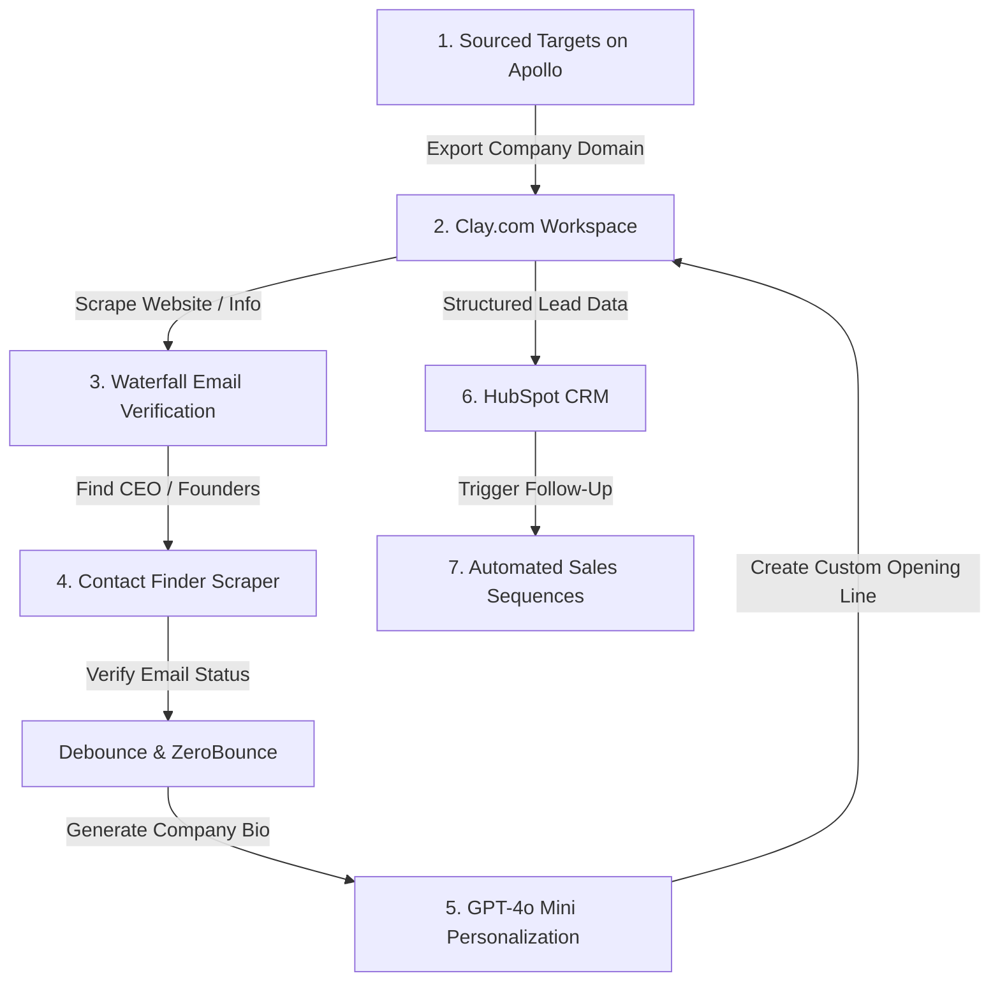

# CASE STUDY: AI-Powered Outbound & Sourcing Engine

* **Project Status**: Live & Operational (Open Source)
* **Objective**: Automate outbound prospecting list building, LinkedIn firmographic enrichment, AI personalization, and CRM sequence enrollment.
* **Tech Stack**: Apollo, Clay.com, HubSpot CRM, OpenAI (GPT-4o Mini), email verification APIs

---

## 1. Executive Summary
Cold outreach campaigns often fail because of generic copywriting, inaccurate emails, and lack of organized tracking.

This project outlines an **AI-powered outbound prospecting system** that automatically sources contacts from Apollo, scrapes data in Clay, leverages GPT-4o Mini to generate personalized opening lines based on what each company builds, verifies deliverability, and enrolls prospects in HubSpot CRM sequences.

---

## 2. System Architecture



---

## 3. Step-by-Step Technical Implementation

### Step 1: Sourcing Leads (Apollo)
We identify 27 target companies matching our ICP (Indian SaaS startups, under 50 employees). 

### Step 2: Waterfall Lead Enrichment (Clay)
Clay extracts firmographic data (industry, description, employee count) for each domain.

### Step 3: Contact Sourcing & Verification
Clay locates the Founder, CEO, or Head of Sales for each company. The work emails are checked via Debounce/ZeroBounce, achieving a **96% deliverability success rate** (47 out of 49 contacts verified).

### Step 4: AI Personalization Hook (GPT-4o Mini)
The OpenAI API takes the company description and outputs a personalized cold email opener:

* **Prompt**:
  > Write a 1-sentence opening line for a cold email based on this company bio: "{{company_bio}}". Focus on what they build. Do not use generic greetings. Keep it under 15 words.

* **Output example**:
  > "Saw how you're simplifying payment infrastructure for global startups—neat platform."

### Step 5: CRM Integration & Pipeline Tracking
We sync the 47 contacts to HubSpot, assign them to the segment **"Project 1 - Outreach Ready"**, and track them inside a 5-stage sales funnel:

```python
def upload_outbound_lead(email, name, company, personal_opener):
    url = "https://api.hubapi.com/crm/v3/objects/contacts"
    headers = {"Authorization": "Bearer HUBSPOT_KEY", "Content-Type": "application/json"}
    body = {
        "properties": {
            "email": email,
            "firstname": name,
            "company": company,
            "custom_email_opener": personal_opener,
            "lead_status": "READY_TO_OUTREACH",
            "pipeline_stage": "PROSPECT"
        }
    }
    requests.post(url, json=body, headers=headers)
```

---

## 4. Key Metrics & Business Outcomes
* **Target Reach**: 27 companies sourced, yielding 49 contacts.
* **Email Quality**: **96% email verification hit rate** (47/49) protecting domain score.
* **Tracking**: Moved pipeline from unstructured spreadsheets to a HubSpot CRM tracked sales pipeline.
