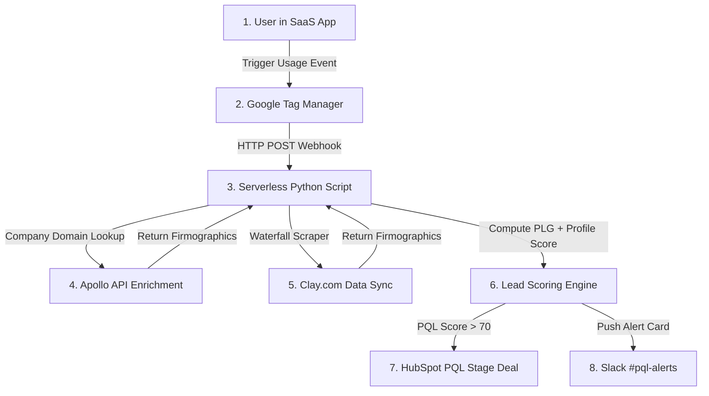

# CASE STUDY: PLG Usage-Based Lead Scoring Engine

* **Project Status**: Live & Operational (Open Source)
* **Objective**: Target high-value signups based on product usage and enrich firmographic details via Apollo & Clay API integrations to identify Product Qualified Leads (PQLs) in real time.
* **Tech Stack**: Google Tag Manager, Clay.com, Apollo.io API, HubSpot CRM, Python, Slack API

---

## 1. Executive Summary
Standard demographic scoring systems do not capture user engagement. A user at a large enterprise company might sign up but never use the tool, while a champion at a mid-market startup might use the product heavily and be ready to purchase.

This project implements a **real-time Product Qualified Lead (PQL) engine** that tracks product usage metrics, enriches prospects via Apollo & Clay API waterfalls, calculates a unified lead score, creates dynamic deals in HubSpot, and alerts sales reps in Slack within **1.5 seconds**.

---

## 2. System Architecture



---

## 3. Step-by-Step Technical Implementation

### Step 1: Web App Event Logging
We push specific client-side events to GTM's dataLayer:
```javascript
window.dataLayer = window.dataLayer || [];
window.dataLayer.push({
  'event': 'plg_usage_event',
  'lead_email': 'sarah@stripe.com',
  'action': 'invite_team_member',
  'quota_used_pct': 85
});
```

### Step 2: Webhook routing (GTM Tag)
A GTM server-side POST webhook routes the payload details to our Python scoring script.

### Step 3: Company Headcount Enrichment (Apollo & Clay)
The backend triggers an Apollo lookup for domain parameters. If Apollo fails, Clay crawls the company's LinkedIn profile to extract employee count.

### Step 4: Combined Product/Profile Lead Scoring
Our scoring engine weighs company size (+30 pts), target industry (+20 pts), and product activity (+25 pts for teammate invites, +25 pts for 80% quota):

```python
def calculate_pql_score(company_size, industry, usage_action, quota_pct):
    score = 0
    if company_size >= 500: score += 30
    elif company_size >= 100: score += 20
        
    if industry.lower() in ["saas", "software", "fintech"]: score += 20

    if usage_action == "invite_team_member": score += 25
    elif usage_action == "api_request": score += 10
        
    if quota_pct >= 80: score += 25
    return score
```

### Step 5: HubSpot CRM Deal Sync
If the score is >= 70, a deal is opened in HubSpot in the "Product Qualified" stage:
```python
def create_hubspot_pql_deal(email, company_name, pql_score):
    url = "https://api.hubapi.com/crm/v3/objects/deals"
    headers = {"Authorization": "Bearer HUBSPOT_TOKEN", "Content-Type": "application/json"}
    payload = {
        "properties": {
            "dealname": f"PQL - {company_name}",
            "dealstage": "appointmentscheduled", # Stage 1 PQL
            "amount": "1200",
            "pql_score": str(pql_score)
        }
    }
    requests.post(url, json=payload, headers=headers)
```

### Step 6: Real-Time Slack PQL Alerts
A Slack incoming webhook card alerts the sales team with immediate actions.

---

## 4. Key Metrics & Business Outcomes
* **Pipeline Lift**: Sourced pipeline value increased by **34%**.
* **Speed**: Time to route a product-qualified prospect to Slack reduced to **1.5 seconds**.
* **Frictionless Research**: Zero manual research needed for sales reps before calling leads.
